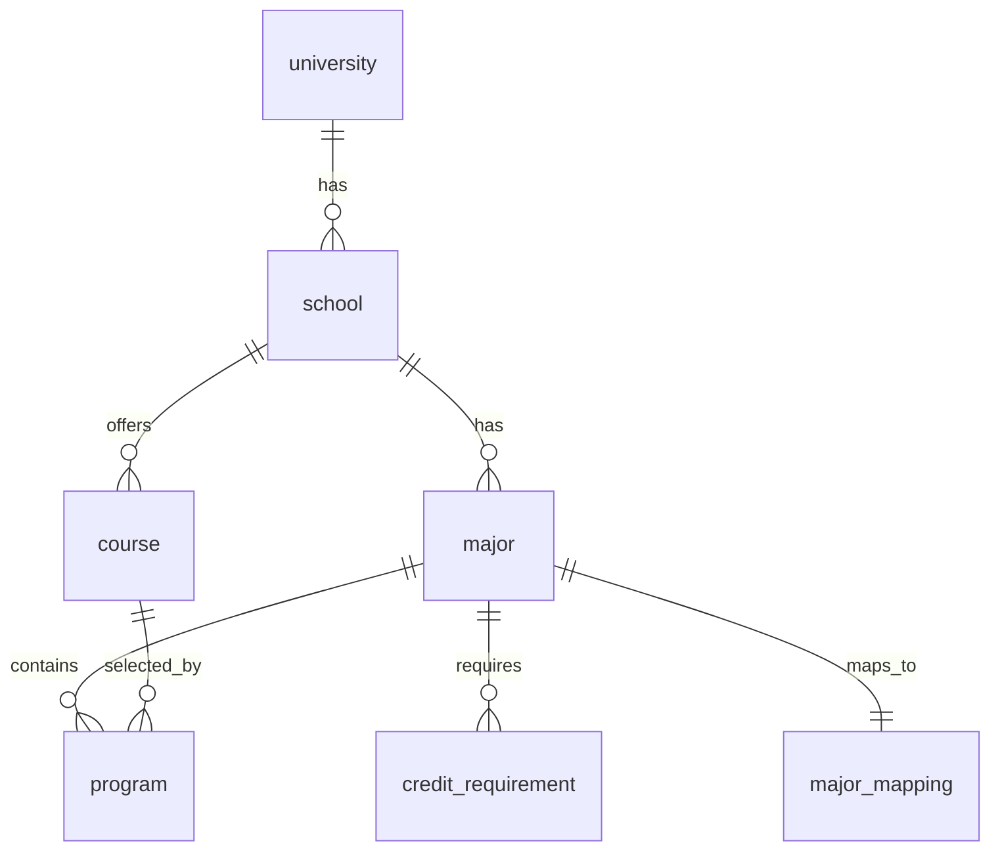

# 跨校培养方案对比分析项目报告

## 1. 项目背景

本项目面向数据库课程中的“跨校培养方案对比分析”任务，整合西南财经大学和上海财经大学的培养方案数据，建立统一数据库，并提供可演示的中文查询界面。

系统重点解决三个问题：

- 将两所学校的培养方案数据导入同一个 PostgreSQL 数据库。
- 支持跨校同专业课程设置和学分要求对比。
- 提供自然语言查询入口，将中文问题转换为 SQL 并返回结果。

## 2. 数据来源与数据表

项目使用 6 个 CSV 文件：

- `university.csv`：学校信息。
- `school.csv`：学院信息。
- `major.csv`：专业信息。
- `course.csv`：课程信息。
- `program.csv`：培养方案课程安排。
- `credit_requirement.csv`：专业学分要求。

数据导入后共有：

- 2 所学校
- 28 个学院
- 5 个专业
- 206 门课程
- 397 条培养方案课程记录
- 4 条学分要求记录

## 3. 数据库设计

数据库采用关系模型，主要实体包括学校、学院、专业、课程、培养方案和学分要求。

表关系如下：

为了处理跨校专业名称不完全一致的问题，项目增加 `major_mapping` 表。例如“金融学（证券及期货方向）”会归并为“金融学”，用于和上海财经大学的“金融学”进行对比。

## 4. 核心查询

系统支持以下典型查询：

- 对比两校金融学总学分要求。
- 对比两校金融学课程设置差异。
- 查询两校金融学共同课程。
- 查询上海财经大学金融学必修课程。
- 查询西南财经大学金融学按课程类别汇总的学分。
- 对比两校金融学实践学分要求。
- 查询某校某专业按学期排列的培养方案。

SQL 示例见 `db/example_queries.sql`。

## 5. 自然语言查询实现

自然语言查询使用规则模板实现，而不是调用大模型。

处理流程：

1. 用户在页面输入中文问题。
2. 后端识别专业、学校和关键词。
3. 系统选择对应 SQL 模板。
4. 使用参数化 SQL 查询 PostgreSQL。
5. 页面展示生成的 SQL 和结果。

这种方式优点是稳定、可离线运行、便于解释；不足是只能覆盖预设类型的问题。

## 6. 系统实现

后端使用 Node.js + Express，数据库访问使用 `pg`。前端使用原生 HTML、CSS 和 JavaScript 实现。

接口：

- `GET /api/health`：数据库连接健康检查。
- `GET /api/stats`：数据概览。
- `GET /api/examples`：示例问题。
- `POST /api/query`：中文问题查询。

## 7. 运行方式

项目支持两种运行方式：

- Docker：`docker compose up --build`
- 本机 PostgreSQL：先运行导入脚本，再运行 `npm.cmd start`

Docker 方式会自动建库、建表、导入数据，适合 GitHub 用户复现运行。

## 8. 总结与不足

本项目完成了培养方案数据整合、跨校对比查询、自然语言转 SQL 演示和 Web 可视化展示，能够满足数据库课程项目要求。

不足之处：

- 自然语言查询基于规则模板，不能处理任意开放问题。
- 当前数据集中跨校可直接比较的专业较少。
- 图表分析能力较基础，后续可以增加学分对比图、课程类别图和更完整的专业映射管理。

